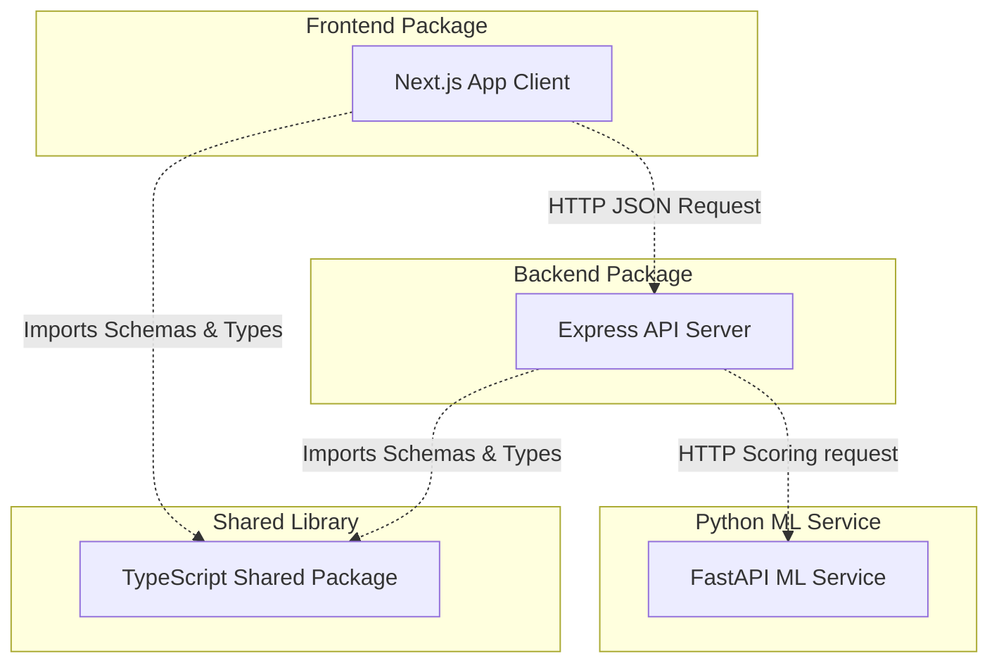

# Architecture Overview - OutlierX Platform

This document describes the high-level software architecture, layered structure, and service interfaces for the AI-powered Financial Anomaly Detection SaaS.

## Monorepo Workspace Design

The application utilizes an `npm` monorepo workspace to manage distinct software contexts while sharing structural interfaces:

---

## Workspace Directory Tree Explanation

- **`frontend/`**: Single Page Application compiled with Next.js 15 (App Router). Implements UI views, state caching, charts, forms, and handles integration with Clerk authentication elements.
- **`backend/`**: Node.js Express service built with TypeScript. Follows repository-pattern abstraction layers and handles core authentication, transactional schemas verification, audits logging, and PostgreSQL integration via Prisma ORM client.
- **`ml-service/`**: Python FastAPI microservice encapsulating ML analytics. Exposes inference API endpoints to analyze transaction records (anomaly score, categorization alerts) using numpy, pandas, and scikit-learn.
- **`packages/shared/`**: Common TypeScript dependency. Houses common type definitions (`Transaction`, `User`), validation schemas (`TransactionCreateSchema`), and core constants (`ERROR_CODES`, `RULE_TYPES`) to enforce consistency.

---

## Architectural Principles

1. **Separation of Concerns**: Each microservice maintains distinct configurations, dependencies, and deployment logic.
2. **Layered Boundary Isolation**: The backend separates transport logic (Express routes and controllers) from business logic (services layer) and data access layers (repositories).
3. **Validation at Boundaries**: Request inputs are validated at route borders using Zod schemas imported from `@anomaly/shared`.
4. **Single Source of Truth**: Shared properties, schemas, and helpers reside inside the `@anomaly/shared` folder, preventing duplicate representations and interface mismatches.
5. **Dependency Injection**: Services receive repositories through constructor injectors, facilitating test mock swaps.

---

## Deterministic Rule Engine

OutlierX includes a dedicated rule module at `backend/src/modules/rules` for explainable fraud scoring. The module is isolated from Express transport concerns:

- Controllers validate authenticated HTTP requests and delegate to services.
- Services coordinate rule CRUD, audit logging, execution recording, and default-rule provisioning.
- Engine classes evaluate condition trees, calculate scores, and generate human-readable explanations without importing API types.
- Repositories contain Prisma access for `Rule`, `RuleGroup`, `RuleCondition`, `RuleExecution`, and `RuleResult`.

Rules are organization-scoped, configurable, and deterministic. They support nested `AND`/`OR` condition groups and produce a `0-100` rule score with `LOW`, `MEDIUM`, `HIGH`, or `CRITICAL` risk levels. CSV uploads trigger rule evaluation after successful transaction persistence, while `/rules/test` supports playground evaluation without storing transaction records.
